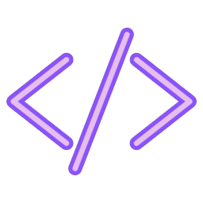

  

  My developer portfolio to showcase a few projects, and some extra information about me.

  
  <h4>Carlos Leão Portfolio</h4>
  

  <a href="#about">About</a>|
  <a href="#art-layout-of-the-application">Layout</a>|
  <a href="#rocket-getting-started">Getting started</a>|
  <a href="#man_technologist-used-technologies">Technologies</a>

## About

- **Carlos Leão Portfolio** is an application that provides information about the projects I have worked on, my experiences and my journey. You can also contact me by sending me an email through this application.

- The main goal of this project was to create a platform for people to get to know me better.

- The project was developed using [ReactJs](https://reactjs.org/).

- The website offers support for both English and Portuguese languages.
